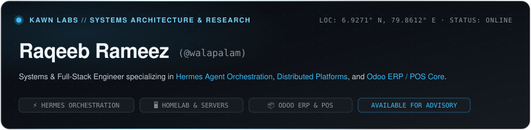
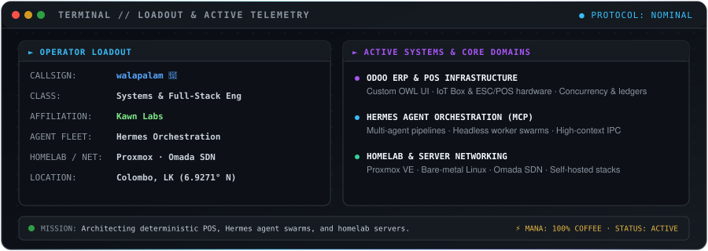

  

 

  

 

  
  
  
  

 

---

### 🎮 Tech Loadout & Capability Matrix

#### 📦 Odoo ERP & High-Reliability POS

#### ⚡ Hermes Agent Orchestrations & Tooling

-161b22?style=flat-square&logo=probot&logoColor=38bdf8)

#### 🛡️ Edge Infrastructure & Zero-Trust Mesh

#### 🛠️ Application Engineering & Mobile

---

### 🗺️ Active Quests & Systems

* **📦 High-Reliability Odoo ERP & POS Engine** — Custom Odoo 19 POS restaurant engine with strict UUID concurrency locking, dynamic split-ticket retention, ESC/POS kitchen routing, and dual-layer terminal limits.
* **⚡ Hermes Agent Orchestration & Swarms** — Architecting low-latency Inter-Process Communication (IPC) pipelines, MCP servers, and autonomous Hermes worker daemons with persistent memory graphs.
* **🛡️ Zero-Trust Site-to-Site Infrastructure** — Edge network failover automation, Omada multi-WAN gateway routing, and air-gapped server promotion pipelines.
* **🚀 VisuaLit & Open R&D** — Multimodal AI exploratory reading pipelines and developer tooling.

---

  <b>walapalam 🍌</b> · Engineering & Systems Architecture @ <a href="https://kawnlabs.com">Kawn Labs</a> · Final Year BSc (Hons) Computer Science

